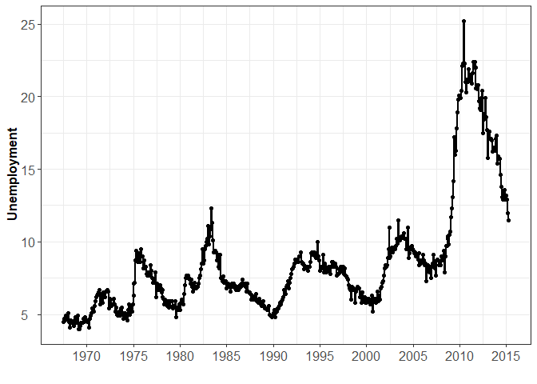

<!-- README.md is generated from README.Rmd. Please edit that file -->

# ggDarwin

<!-- badges: start -->

<!-- badges: end -->

The goal of ggDarwin is to …

## Installation

You can install the development version of ggDarwin like so:

``` r
# FILL THIS IN! HOW CAN PEOPLE INSTALL YOUR DEV PACKAGE?
```

## Example

This is a basic example which shows you how to solve a common problem:

``` r
library(ggDarwin)
library(dplyr)
#> Warning: package 'dplyr' was built under R version 4.1.3
#> 
#> Attaching package: 'dplyr'
#> The following objects are masked from 'package:stats':
#> 
#>     filter, lag
#> The following objects are masked from 'package:base':
#> 
#>     intersect, setdiff, setequal, union
library(ggplot2)
library(lubridate)
#> Warning: package 'lubridate' was built under R version 4.1.2
#> 
#> Attaching package: 'lubridate'
#> The following objects are masked from 'package:base':
#> 
#>     date, intersect, setdiff, union


Sys.setlocale("LC_TIME", "English")
#> [1] "English_United States.1252"

# Example 1-----
head(economics)
#> # A tibble: 6 x 6
#>   date         pce    pop psavert uempmed unemploy
#>   <date>     <dbl>  <dbl>   <dbl>   <dbl>    <dbl>
#> 1 1967-07-01  507. 198712    12.6     4.5     2944
#> 2 1967-08-01  510. 198911    12.6     4.7     2945
#> 3 1967-09-01  516. 199113    11.9     4.6     2958
#> 4 1967-10-01  512. 199311    12.9     4.9     3143
#> 5 1967-11-01  517. 199498    12.8     4.7     3066
#> 6 1967-12-01  525. 199657    11.8     4.8     3018

# Information required
time <- "year" # Time units (day, month, week or year)
interval <- 5  # Interval between x-axis breaks
start <- min(economics$date) # Start date
end <- max(economics$date) # End date

# Plot
y.var <- economics$uempmed
y.name <- "Unemployment"
economics %>%
  ggplot()+
  geom_point(aes(date,y=y.var))+
  geom_line(aes(date,y=y.var), size=0.8)+
  scale_y_continuous(name= y.name)+
  xlab("")+
  theme(axis.text.x = element_text(angle=90, size =9),
        axis.title.y = element_text(size = 9),
        plot.margin=grid::unit(c(1,1,1,1), "cm"))+
  gg_darwin_time_series(time,start,end, interval)+
  gg_darwin_theme()
```


