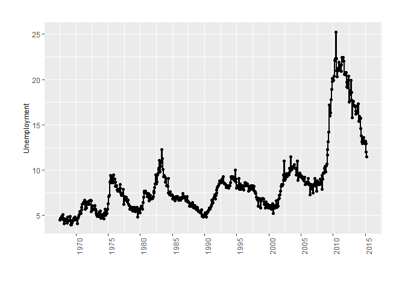

<!-- README.md is generated from README.Rmd. Please edit that file -->

# ggDarwin

<!-- badges: start -->

<!-- badges: end -->

The goal of ggDarwin is to …

## Installation

You can install the development version of ggDarwin from
[GitHub](https://github.com/) with:

``` r
# install.packages("devtools")
devtools::install_github("edward-burn/ggDarwin")
```

## Example

``` r
library(dplyr)
#> Warning: package 'dplyr' was built under R version 4.1.3
#> 
#> Attaching package: 'dplyr'
#> The following objects are masked from 'package:stats':
#> 
#>     filter, lag
#> The following objects are masked from 'package:base':
#> 
#>     intersect, setdiff, setequal, union
library(ggplot2)
library(ggDarwin)
```


Now with gg\_darwin\_time\_series()

