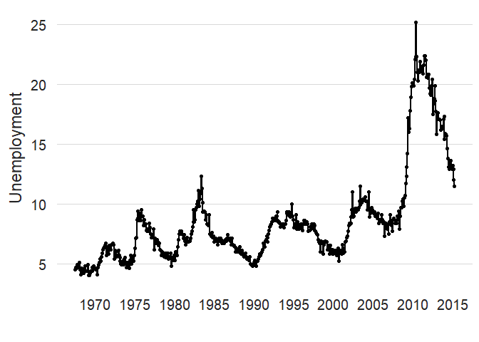

<!-- README.md is generated from README.Rmd. Please edit that file -->

# ggDarwin

<!-- badges: start -->

<!-- badges: end -->

The goal of ggDarwin is to …

## Installation

You can install the development version of ggDarwin like so:

``` r
install.packages("remotes")
remotes::install_github("edward-burn/ggDarwin")
```

## Example

Before ggDarwin

``` r
library(ggDarwin)
library(dplyr)
#> Warning: package 'dplyr' was built under R version 4.1.3
#> 
#> Attaching package: 'dplyr'
#> The following objects are masked from 'package:stats':
#> 
#>     filter, lag
#> The following objects are masked from 'package:base':
#> 
#>     intersect, setdiff, setequal, union
library(ggplot2)
library(lubridate)
#> Warning: package 'lubridate' was built under R version 4.1.2
#> 
#> Attaching package: 'lubridate'
#> The following objects are masked from 'package:base':
#> 
#>     date, intersect, setdiff, union


Sys.setlocale("LC_TIME", "English")
#> [1] "English_United States.1252"

# Example 1-----

# Plot
y.var <- economics$uempmed
y.name <- "Unemployment"
economics %>%
  ggplot()+
  geom_point(aes(date,y=y.var))+
  geom_line(aes(date,y=y.var), size=0.8)+
  scale_y_continuous(name= y.name)+
  xlab("")+
  theme(axis.text.x = element_text(angle=90, size =9),
        axis.title.y = element_text(size = 9),
        plot.margin=grid::unit(c(1,1,1,1), "cm"))
```


And now with ggDarwin

``` r
time <- "year" # Time units (day, month, week or year)
interval <- 5  # Interval between x-axis breaks
start <- min(economics$date) # Start date
end <- max(economics$date) # End date

economics %>%
  ggplot()+
  geom_point(aes(date,y=y.var))+
  geom_line(aes(date,y=y.var), size=0.8)+
  scale_y_continuous(name= y.name)+
  xlab("")+
  theme(axis.text.x = element_text(angle=90, size =9),
        axis.title.y = element_text(size = 9),
        plot.margin=grid::unit(c(1,1,1,1), "cm"))+
  gg_darwin_time_series(time,start,end, interval)+
  gg_darwin_theme()
```


